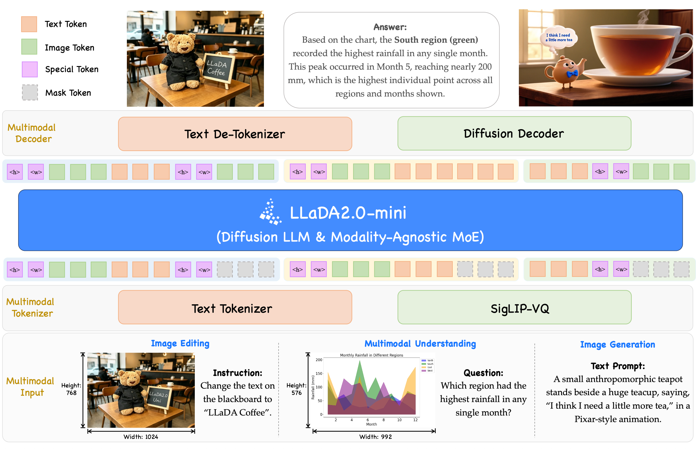

# LLaDA2.0-Uni

[LLaDA2.0-Uni](https://huggingface.co/inclusionAI/LLaDA2.0-Uni) is a multimodal model that supports text and image understanding and generation.

## Highlights

- Unified dLLM-MoE Backbone — Built on LLaDA 2.0, unifying multimodal understanding and generation.
- Top-Tier Understanding & Generation — Matches dedicated VLMs in visual QA and document understanding, while generating high-quality images.
- Interleaved Generation & Reasoning — Empowered by unified discrete representations, unlocking interleaved generation and reasoning.

## Architecture



LLaDA2.0-Uni unifies multimodal understanding and generation into a simple Mask Token Prediction paradigm. Visual inputs are encoded by the SigLIP-VQ tokenizer into discrete semantic tokens, then mapped alongside text tokens to backbone hidden states under a unified mask prediction objective. Output tokens are decoded back to text via the Text De-Tokenizer, or reconstructed into high-fidelity images through the Diffusion Decoder. Empowered by unified discrete representations, it effortlessly handles complex interleaved generation and unlocks advanced interleaved reasoning, interleaving <|image|>...<|/image|> chunks to enable end-to-end training and inference within a single coherent framework.

## Prerequisites

Install `sglang-omni` by following [Installation](../get_started/installation.md).

## Server Configuration

LLaDA2.0-Uni runs a 5-stage pipeline
(`preprocessing → image_encoder → thinker → [decode, image_decode]`) on a
single GPU. The thinker disables CUDA graph by default for this experimental
DLLM path.

```bash
sgl-omni serve --model-path inclusionAI/LLaDA2.0-Uni --port 8000
```

## Text Input

Send a text-only prompt and get a text response.

**cURL**

```bash
curl -X POST http://localhost:8000/v1/chat/completions \
  -H "Content-Type: application/json" \
  -d '{
    "model": "inclusionAI/LLaDA2.0-Uni",
    "messages": [{"role": "user", "content": "Hello!"}],
    "max_tokens": 256
  }'
```

**Python**

```python
import requests

resp = requests.post(
    "http://localhost:8000/v1/chat/completions",
    json={
        "model": "inclusionAI/LLaDA2.0-Uni",
        "messages": [{"role": "user", "content": "Hello!"}],
        "max_tokens": 256,
    },
)
resp.raise_for_status()
result = resp.json()
print(result["choices"][0]["message"]["content"])
```

## Image and Text Input

Send an image with a text prompt to get a text response.

**cURL**

```bash
curl -X POST http://localhost:8000/v1/chat/completions \
  -H "Content-Type: application/json" \
  -d '{
    "model": "inclusionAI/LLaDA2.0-Uni",
    "messages": [{"role": "user", "content": "Briefly describe the cars in this image."}],
    "images": ["tests/data/cars.jpg"],
    "modalities": ["text"],
    "max_tokens": 16
  }'
```

**Python**

```python
import requests

resp = requests.post(
    "http://localhost:8000/v1/chat/completions",
    json={
        "model": "inclusionAI/LLaDA2.0-Uni",
        "messages": [{"role": "user", "content": "Briefly describe the cars in this image."}],
        "images": ["tests/data/cars.jpg"],
        "modalities": ["text"],
        "max_tokens": 16,
    },
)
resp.raise_for_status()
result = resp.json()
print(result["choices"][0]["message"]["content"])
```

Images can also be passed inline using the OpenAI multi-content format:

```python
import requests

resp = requests.post(
    "http://localhost:8000/v1/chat/completions",
    json={
        "model": "inclusionAI/LLaDA2.0-Uni",
        "messages": [
            {
                "role": "user",
                "content": [
                    {"type": "image_url", "image_url": {"url": "tests/data/cars.jpg"}},
                    {"type": "text", "text": "Briefly describe the cars in this image."},
                ],
            }
        ],
        "modalities": ["text"],
        "max_tokens": 16,
    },
)
resp.raise_for_status()
result = resp.json()
print(result["choices"][0]["message"]["content"])
```

## Text-to-image Generation

Request both text and image output and pass decoder settings through the
`image_generation` extension.

```bash
curl -X POST http://localhost:8000/v1/chat/completions \
  -H "Content-Type: application/json" \
  -d '{
    "model": "inclusionAI/LLaDA2.0-Uni",
    "messages": [{
      "role": "user",
      "content": "A bright red apple on a white ceramic plate."
    }],
    "modalities": ["text", "image"],
    "image_generation": {
      "mode": "normal",
      "decode_mode": "decoder-turbo",
      "decoder_steps": 8,
      "seed": 42,
      "cfg_scale": 4.0,
      "image_h": 1024,
      "image_w": 1024,
      "dllm_steps": 8
    }
  }'
```

Image-generating responses use ordered content parts. The PNG is returned as
base64 in the `image.data` field of an image part under
`choices[0].message.content`. In `normal` mode the response normally contains
only an image part; in `thinking` mode a text part precedes the image part.
Thinking mode requires the model to generate `<boi>`; the request fails
explicitly if that boundary token is absent.

```json
{
  "choices": [{
    "message": {
      "role": "assistant",
      "content": [{
        "type": "image",
        "image": {"data": "<base64 PNG>", "format": "png"}
      }]
    }
  }]
}
```

The response also includes a `timings` object with per-stage and end-to-end
latencies. Run the checked-in reproduction script to print text and timings and
decode image responses:

```bash
examples/llada2_uni/validate_t2t_t2i.sh all
examples/llada2_uni/validate_t2t_t2i.sh t2t
examples/llada2_uni/validate_t2t_t2i.sh t2i-normal
examples/llada2_uni/validate_t2t_t2i.sh t2i-thinking
```

Set `BASE_URL`, `MODEL`, `OUT_DIR`, or `TIMEOUT` to override the script
defaults.

## Interleaved Text and Image Generation

Interleaved generation uses a dedicated pipeline that isolates the thinker and
image decoder on separate GPUs:

```bash
sgl-omni serve \
  --config examples/configs/llada2_uni_interleaved.yaml \
  --port 8000
```

The request must be non-streaming and text-only. The response uses the same
ordered content-part schema as text-to-image generation, so text and images
remain in their generated order.

```bash
curl -X POST http://localhost:8000/v1/chat/completions \
  -H "Content-Type: application/json" \
  -d '{
    "model": "inclusionAI/LLaDA2.0-Uni",
    "messages": [{
      "role": "user",
      "content": "Explain how a seed grows, with an illustration for each step."
    }],
    "modalities": ["text", "image"],
    "stream": false,
    "interleaved_generation": {
      "max_frames": 3,
      "dllm_steps": 32,
      "cfg_scale": 0.0,
      "cfg_text_scale": 7.5,
      "cfg_image_scale": 1.5,
      "decode_mode": "decoder-turbo",
      "decoder_steps": 8,
      "seed": 42
    }
  }'
```

Each image part includes `data`, `format`, `frame_index`, `grid_h`, and
`grid_w`. Set all three CFG scales to `0` to disable CFG and run only the
conditional branch. The default scales use one conditional, one no-text, and,
for later editing-style frames, one no-image branch.

## Request Parameters

The table below lists all parameters accepted by the `/v1/chat/completions` endpoint for LLaDA2.0-Uni.

| Parameter | Type | Default | Description |
|---|---|---|---|
| `model` | string | `null` | Model identifier |
| `messages` | list | (required) | List of chat messages, each with `role` and `content` |
| `modalities` | list | `["text"]` | Output modalities, including `"text"` and `"image"` |
| `images` | list | `null` | List of image file paths (local paths or URLs) |
| `max_tokens` | int | `null` | Maximum number of tokens to generate |
| `image_generation` | object | `null` | Image mode, decoder, CFG, resolution, seed, and dLLM settings |
| `interleaved_generation` | object | `null` | Interleaved frame limit, text/image dLLM settings, CFG, decoder, and seed settings |

## Known Limitations

- Image and interleaved-generation requests with `stream=true` are rejected
  with HTTP 400. Use `stream=false`.
- Interleaved generation currently accepts text-only input. Requests containing
  images, audio, video, or other non-text input are rejected with HTTP 400.
- Decoder output size follows the VQ token grid emitted by the thinker and can
  differ from the requested conditioning size when the token count differs.
- Thinking T2I fails if Phase 1 does not generate the required `<boi>` token.
