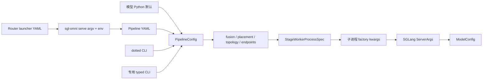

# 配置来源与传参链路

本文调研当前 `sgl-omni` 与 `sgl-omni-router` 的配置来源、覆盖顺序和运行时传递边界。重点回答：

- 命令行参数与 Pipeline YAML 分别负责什么；
- 同一值出现于多个来源时，哪一层生效；
- 配置怎样从主进程传到 stage worker 和 SGLang；
- 哪些值由用户设置，哪些值由 placement、process planner 或 worker 派生。

字段和拓扑的逐项定义参见 [Config](./config.md)。本文描述的是配置如何进入这些字段并最终被运行时消费。结论基于当前 `sgl-omni serve`、Router 和对应单元测试，不覆盖 benchmark、CI 配置或模型内部 Hugging Face/Hydra 配置。

## 1. 总体心智模型

配置不是一次 `CLI dict` 与 `YAML dict` 的简单合并。当前系统有三条相互衔接但 owner 不同的链路：

1. **Pipeline 声明链路**：模型 Python 默认、Pipeline YAML、动态 dotted CLI 和专用 CLI 最终形成一个 `PipelineConfig`。
2. **Worker 构造链路**：主进程把 `PipelineConfig` 编译为 placement、process topology 和可 pickle 的 worker spec；子进程再构造 factory kwargs、`ServerArgs` 和 `ModelConfig`。
3. **Router 管理链路**：Router YAML 描述完整 worker 副本，Router 将其转换为多个 `sgl-omni serve` 命令和各自的环境变量。



安装入口位于 `pyproject.toml`：

- `sgl-omni` → `sglang_omni.cli:app`
- `sgl-omni-router` → `sglang_omni_router.serve:main`

`sgl-omni serve` 使用 Typer/Click，并且只有该子命令启用了 `allow_extra_args=True` 和 `ignore_unknown_options=True`。因此它同时拥有固定的公共参数和开放的 dotted override。Router 使用 argparse，只接受显式注册的参数。

## 2. 配置来源与职责

### 2.1 模型 Python 默认

每个模型包通过 `EntryClass` 注册一个 `PipelineConfig` 子类。未指定 `--config` 时，`ConfigManager.from_model_path()` 从 Hugging Face、原始 `config.json` 或 Mistral 元数据解析 architecture，再从 `PIPELINE_CONFIG_REGISTRY` 选择配置类。

配置类是拓扑和模型默认值的 source of truth，包括：

- stage 列表与 factory；
- routing、fan-in、streaming；
- GPU、TP 和 process 的默认布局；
- `factory_args`、typed runtime 和环境变量默认值；
- public role 到模型 stage 名的映射。

例如 Qwen3-Omni 分别提供 text、speech 和 speech-colocated 配置类；`--text-only` 在没有 `--config` 时选择 `Variants["text"]`。相关实现位于：

- `sglang_omni/config/manager.py`：`resolve_config_cls_for_model_path()`、`ConfigManager.from_model_path()`
- `sglang_omni/models/registry.py`：配置类注册与按类名查找
- `sglang_omni/models/qwen3_omni/config.py`：Qwen3-Omni variants 和 public role maps

### 2.2 Pipeline YAML

`sgl-omni serve --config FILE` 只加载显式给出的文件；没有按目录扫描、扩展名限制、include 或 `extends`。入口是 `ConfigManager.from_file()`，使用 `yaml.safe_load()`，顶层必须是 mapping。

YAML 至少需要：

```yaml
config_cls: MossTTSPipelineConfig
model_path: OpenMOSS-Team/MOSS-TTS-v1.5
```

`config_cls` 不是 Python import path，而是在模型 registry 中注册的配置类名。加载器用该类构造 Pydantic model，因此 YAML 继承了 Python 配置类没有显式覆盖的 topology/default。未知字段由各层 Pydantic model 的 `extra="forbid"` 拒绝。

Pipeline YAML 有两种用法：

1. **紧凑配置**：只选择 `config_cls` 并覆盖少量顶层字段、`runtime_overrides` 或 `stage_overrides`。`examples/configs/qwen3_omni_colocated_h20.yaml` 属于这种形式。
2. **完整配置**：显式提供整个 `stages` 列表。此时列表整体替换配置类默认 stages，不执行按 stage 的列表合并。`examples/configs/ming_omni_tts.yaml` 是完整形式。

`stage_overrides` 是加载器识别的紧凑语法，目前只允许按 stage 名深合并 typed `runtime`：

```yaml
config_cls: Qwen3OmniSpeechColocatedPipelineConfig
model_path: Qwen/Qwen3-Omni-30B-A3B-Instruct

stage_overrides:
  thinker:
    runtime:
      resources:
        total_gpu_memory_fraction: 0.75
```

它不能设置 `gpu`、`process` 或 `factory_args`。这些字段应写入完整 `stages`，或使用对应 CLI。未知 stage、非 mapping 值、`runtime` 之外的 key 都会在加载时失败。

`runtime_overrides` 则是兼容性更强的 per-stage factory 参数通道：

```yaml
runtime_overrides:
  thinker:
    server_args_overrides:
      max_running_requests: 4
```

二者名字相似但作用层不同：

- `stage_overrides.<stage>.runtime` 修改 typed `StageRuntimeConfig`；
- `runtime_overrides.<stage>` 在 factory kwargs 解析阶段覆盖 `factory_args`。

### 2.3 动态 dotted CLI

Typer 未识别的 `serve` 参数会保留在 `ctx.args`，由 `ConfigManager.parse_extra_args()` 处理。支持两种写法：

```bash
sgl-omni serve --config config.yaml \
  --stages.thinker.runtime.resources.total-gpu-memory-fraction 0.35

sgl-omni serve --config config.yaml \
  --stages.4.tp-size=2
```

规则如下：

- key/value 必须成对，也可写成 `--key=value`；
- 去掉 key 前导 `-`，把 `-` 转为 `_`，`.` 保持为路径分隔符；
- list 可用数字下标或元素的 `name` 寻址，因此 `stages.4` 与 `stages.thinker` 都可用；
- 重复 key 由后值覆盖前值；
- scalar 依次尝试 `true/false/none`、`int`、`float`，否则保留字符串；
- 通用解析器不会把字符串转换成 list 或 dict。

`tp_size` 与 `parallelism.tp` 是兼容别名。dotted CLI 只修改其中一个时，`ConfigManager` 会同步另一边；若最终值冲突，Pydantic validation 拒绝配置。

该通道适合临时修改标量或精确定位内部字段，不适合表达复杂列表、dict 和完整 stage。它也是开放接口：可用路径取决于所选模型配置实例，不存在一张跨模型固定参数表。

实现和证明测试：

- `sglang_omni/config/manager.py`：`parse_extra_args()`、`merge_config()`、`_resolve_list_index()`、`_convert_scalar()`
- `tests/unit_test/qwen3_omni/test_config_manager.py`：数字/命名 stage 路径、类型转换和 TP alias

### 2.4 专用 typed CLI

`sgl-omni serve` 还声明了 41 个稳定公共参数。Typer 负责基础类型转换；CLI helper 再执行范围、互斥、模型能力和 topology 校验。专用参数的目标分成两类：

- **服务参数**：直接传给 `launch_server()`，不进入 `PipelineConfig`；
- **Pipeline override**：修改 stage placement、typed runtime、`factory_args` 或 `server_args_overrides`。

大多数可选 override 以 `None` 或 `"default"` 表示“保留 YAML/模型默认”，而不是写入一个新的默认值。

#### 配置、拓扑与服务

| 参数 | 默认值 | 最终作用域 | 说明 |
| --- | --- | --- | --- |
| `--model-path` | `None` | Pipeline | 无 YAML 时用于选择配置类；显式提供时还会覆盖 YAML `model_path` |
| `--config` | `None` | 配置加载 | Pipeline YAML 路径 |
| `--text-only` | `False` | 配置选择 | 无 YAML 时选择 text variant；不是对任意 YAML 删除 speech stage |
| `--colocate` | `False` | 校验/日志 | 当前要求 Qwen colocated 配置，并要求同时给出 `--config` |
| `--isolate-stage` | `None` | stage process | 可重复；`STAGE=STAGE` 的简写 |
| `--stage-process` | `None` | stage process | 可重复；按 `STAGE=PROCESS` 分组或隔离 stage |
| `--host` | `0.0.0.0` | HTTP server | 不进入 Pipeline |
| `--port` | `8000` | HTTP server | 不进入 Pipeline |
| `--model-name` | Pipeline name | API server | `/v1/models` 暴露的名称 |
| `--log-level` | `info` | 主进程/server | 也控制是否打印 merged config；`debug` 会打印 |
| `--allowed-local-media-path` | `None` | API server | `file://` 媒体允许目录 |
| `--allowed-media-domain` | `None` | API server | 可重复，也支持单项逗号分隔 |
| `--tts-batch-max-items` | `32` | API server | `/v1/audio/speech/batch` 最大 items |
| `--enable-realtime` | `False` | API server | 挂载 `/v1/realtime` |

#### 内存、量化、GPU 与 TP

| 参数 | 默认值 | 写入位置 | 关键规则 |
| --- | --- | --- | --- |
| `--mem-fraction-static` | `None` | role stage typed runtime | supported SGLang AR stages 的全局 fallback |
| `--thinker-mem-fraction-static` | `None` | thinker typed runtime | 高于 global flag |
| `--talker-mem-fraction-static` | `None` | talker typed runtime | 高于 global flag |
| `--encoder-mem-reserve` | `None` | thinker `factory_args` | 仅用于 auto-picked thinker fraction；与显式 thinker fraction 互斥 |
| `--cpu-offload-gb` | `None` | thinker `server_args_overrides` | 必须非负 |
| `--quantization` | `None` | thinker `server_args_overrides` | 必须是非空字符串 |
| `--thinker-tp-size` | `None` | thinker `tp_size`/`parallelism.tp` | 同步两个 alias |
| `--thinker-gpus` | `None` | thinker `gpu` | 接受 `0`、`0,1` 或 `[0, 1]` |
| `--image-encoder-tp-size` | `None` | image encoder TP | 同步两个 alias |
| `--image-encoder-gpus` | `None` | image encoder `gpu` | GPU 数量必须匹配 TP |
| `--talker-gpu` | `None` | model-mapped talker stage | 依赖配置类 public role map |
| `--code2wav-gpu` | `None` | model-mapped code2wav stage | 不支持的 pipeline 会拒绝 |

`--mem-fraction-static` 的优先级只发生在专用 CLI 内部：

```text
per-role flag > global flag > 当前 Pipeline 值
```

先校验所有值再修改，避免只覆盖了一部分 stage。`--encoder-mem-reserve` 不能和 global/thinker memory flag 共用；如果 YAML 已通过 typed runtime 或兼容 `server_args_overrides` 固定 thinker fraction，也会拒绝。

#### 执行优化和容量

| 参数 | 默认值 | 写入位置 | 说明 |
| --- | --- | --- | --- |
| `--thinker-cuda-graph` | `default` | thinker `server_args_overrides` | `default/on/off` |
| `--talker-cuda-graph` | `default` | mapped SGLang talker stage | `default/on/off` |
| `--talker-partial-start` | `default` | Qwen talker `factory_args` | 仅支持声明的 Qwen talker factory |
| `--thinker-torch-compile` | `default` | thinker `server_args_overrides` | `default/on/off` |
| `--talker-torch-compile` | `default` | mapped SGLang talker stage | `default/on/off` |
| `--thinker-torch-compile-max-bs` | `None` | thinker `server_args_overrides` | 必须大于 0 |
| `--talker-torch-compile-max-bs` | `None` | mapped SGLang talker stage | 必须大于 0 |
| `--decode-mode` | `None` | supported factories | `async/sync`，覆盖 `enable_async_decode` |
| `--async-lookahead-min-batch-size` | `None` | supported factories | 与 `--decode-mode sync` 互斥 |
| `--thinker-max-running-requests` | `None` | thinker `server_args_overrides` | thinker 专用容量 |
| `--prefill-coalesce-requests` | `None` | supported factories | `< 2` 不启用 gate |
| `--prefill-coalesce-wait-ms` | `None` | supported factories | 单独设置不一定启用 coalescing |
| `--max-running-requests` | `None` | generation role stage | 通用 generation stage 容量 |
| `--max-total-tokens` | `None` | generation role stage | KV pool token cap |
| `--cuda-graph-max-bs` | `None` | generation role stage | generation CUDA graph batch cap |

这些 flag 不靠固定 stage 名猜测所有模型。配置类通过 `mem_fraction_role_to_stage()`、`talker_role_to_stage()`、`generation_sglang_role_to_stage()` 等 class method 把公共 role 映射到模型 stage；缺少映射或 stage 时，CLI 明确报 unsupported。

CLI 别名以 kebab-case 为主，部分参数保留 underscore 兼容形式。CUDA graph 还保留 `--thinker_CUDA_graph` 和 `--talker_CUDA_graph`。精确 spelling 以 `sglang_omni/cli/serve.py` 的 `serve()` 签名为准。

### 2.5 环境变量

Pipeline 和 stage 都可声明环境默认值：

```text
真实 os.environ > stage.env > pipeline.env_defaults
```

这里的 `>` 表示已存在的 operator 环境变量不会被配置覆盖；stage default 在合并 dict 时高于 pipeline default。若同一 OS process 中多个 stage 对同一变量声明不同默认值，启动前会拒绝，避免 process 级环境产生 stage 级歧义。

TP worker 还会在 spawn 周围由主进程临时设置：

- `CUDA_VISIBLE_DEVICES`
- `SGLANG_ONE_VISIBLE_DEVICE_PER_PROCESS=true`
- `SGLANG_ENABLE_TP_MEMORY_INBALANCE_CHECK=false`

子进程因此只看到分配给本 rank 的设备，并把逻辑 `gpu_id` 规范化为本地设备 0。主进程在 `proc.start()` 后恢复自己的环境。

相关实现位于 `sglang_omni/pipeline/mp_runner.py` 和 `sglang_omni/pipeline/stage_workers.py`。

## 3. `serve` 的精确合并顺序

### 3.1 主进程顺序

`serve()` 中的实际顺序如下，从低到高读取：

1. **基础配置**
   - 有 `--config`：YAML 顶层构造模型配置类，再应用 YAML `stage_overrides`；
   - 否则：由 `--model-path` 选择模型配置类，`--text-only` 可选择 text variant。
2. **动态 dotted CLI**
   - `ConfigManager.merge_config()` 对 `model_dump()` 的深拷贝修改路径，再用同一配置类整体重建并校验。
3. **显式 `--model-path`**
   - 通过 `model_copy(update=...)` 覆盖 YAML 内的路径。
4. **专用 Pipeline CLI**
   - memory fraction；
   - encoder reserve；
   - thinker ServerArgs；
   - TP/GPU；
   - process placement；
   - CUDA graph；
   - torch compile；
   - decode mode；
   - prefill coalescing；
   - generation ServerArgs；
   - talker partial start。
5. **服务 CLI**
   - `host`、`port`、API media policy、realtime 等直接传给 `launch_server()`。

因此常规同字段覆盖可概括为：

```text
模型类默认
< YAML 顶层
< YAML stage_overrides
< dotted CLI
< 显式 --model-path / 专用 CLI
```

这不是无条件的“最后写入获胜”。遇到 owner 冲突时，系统会拒绝配置而不是挑选一个来源。例如：

- typed `runtime.sglang_server_args.mem_fraction_static` 与 `factory_args/runtime_overrides.server_args_overrides.mem_fraction_static` 同时出现；
- typed `runtime.max_seq_len` 映射目标同时出现在 `runtime_overrides`；
- `gpu_id` 出现在 factory args，而不是由 `stage.gpu`/placement 派生；
- `total_gpu_memory_fraction` 出现在非 typed runtime 路径；
- `--encoder-mem-reserve` 与显式 thinker fraction 同时出现。

另一个细节是，大部分专用 CLI helper 在当前 Pydantic 对象上原地修改。配置 model 没有启用 `validate_assignment=True`，因此 helper 必须先手工校验，或在关键步骤重建 model。不能假设任意属性赋值都会自动触发 Pydantic validator。

### 3.2 如何观察最终结果

`--colocate` 或 `--log-level debug` 会在启动前打印 merged `PipelineConfig`：

```text
==================== Merged Configuration ====================
...
==================================================
```

该输出能观察进入 runtime planner 前的 Pipeline 状态，但不包含随后派生的 endpoint、process cumulative budget、factory signature defaults，也不等于最终 `ServerArgs`。placement/topology 解析结果会在 server 启动日志中单独记录。

`sgl-omni config view --model-path MODEL` 显示模型类默认配置；`config export` 将同一默认配置导出为 YAML。它们不会应用 `serve` 的 YAML、dotted CLI 或专用 CLI 覆盖。

## 4. Pipeline 到 stage worker

### 4.1 主进程只传 resolved spec

`launch_server()` 创建 `MultiProcessPipelineRunner`。runtime preparation 依次处理：

- `apply_fusion()`；
- `StagePlacementPlan`；
- `ProcessTopologyPlan`；
- 每次运行独立的 IPC 目录和 ZMQ endpoints。

随后 `_build_stage_groups()` 为每个逻辑 stage/rank 生成 `StageLaunchConfig`，并按 OS process 分组为 `StageWorkerProcessSpec`。使用 `multiprocessing` 的 `spawn` 启动时，被 pickle 的是这些普通 dataclass/dict/string/queue 组成的 spec，不是原始 argv，也不是完整 `PipelineConfig`。

factory、route、merge 和 projection 都以 dotted import path 保存在 spec 中，子进程才导入。这样主进程不必加载模型侧依赖。

关键代码：

- `sglang_omni/pipeline/runtime_config.py`：`prepare_pipeline_runtime()`
- `sglang_omni/pipeline/mp_runner.py`：`_build_stage_groups()`、单 rank/TP rank spec 构造
- `sglang_omni/pipeline/stage_workers.py`：`StageLaunchConfig`、`StageWorkerProcessSpec`、`StageGroup.spawn()`

### 4.2 factory kwargs 合并

主进程先解析与 factory 签名无关的静态参数：

```text
factory_args
< runtime_overrides
< typed runtime 映射
```

其中 `server_args_overrides` 在 `factory_args` 与 `runtime_overrides` 之间做一层 dict merge；其他 key 直接由 `runtime_overrides` 覆盖。

typed runtime 当前包括：

- `runtime.max_seq_len`
- `runtime.video_fps`
- `runtime.sglang_server_args.mem_fraction_static`
- `runtime.resources.total_gpu_memory_fraction`

`max_seq_len`/`video_fps` 通过 stage 的 `runtime_arg_map` 转为具体 factory 参数名；没有映射会报错。typed `mem_fraction_static` 被放入 `server_args_overrides`。

子进程导入 factory 后，才按其 signature 注入标准默认参数：

- `model_path`
- `gpu_id`
- `total_gpu_memory_fraction`

仅当 factory 声明该参数且用户/前序合并尚未设置时才注入。这些是 fallback，不会覆盖显式 factory kwargs。

### 4.3 owner 与派生值

| 值 | source of truth / owner | 跨进程形式 |
| --- | --- | --- |
| Pipeline topology | `PipelineConfig` | 展开为 worker spec 字段 |
| stage GPU | placement planner | `StageLaunchConfig.gpu_id` |
| TP rank/size | stage config + runner | 每 rank spec |
| NCCL port | 主进程 `_NcclPortAllocator` | factory arg |
| IPC endpoints | runtime preparation | spec 中的字符串 |
| `total_gpu_memory_fraction` | typed stage resources | factory default |
| cumulative process memory fraction | process 构造顺序 | `process_total_gpu_memory_fraction` factory default |
| factory implementation | `StageConfig.factory` | dotted path，子进程 import |
| `ServerArgs` | worker 内 stage factory | 不跨进程 |
| `ModelConfig` | worker 内 `ModelWorker` | 不跨进程 |
| `PortArgs` | worker 内 upstream runner | 不跨进程 |

一个非 TP process 可以包含多个 stage；它们共享 OS process 和 event loop。TP stage 则每 rank 一个独占 process，只有 rank 0 拥有外部 stage IO。

## 5. SGLang `ServerArgs` 链路

SGLang AR stage factory 通常把模型 generation defaults 与 `server_args_overrides` 合并，再调用 `build_sglang_server_args()`。公共 builder 提供：

- `model_path`
- `trust_remote_code=True`
- `tp_size=1`、`pp_size=1`
- prefill/batch 默认值
- `random_seed=123`
- `context_length`

显式 overrides 在公共默认值之后更新。Omni 还会把历史的 `cuda_graph_max_bs`/`cuda_graph_bs` 转为 SGLang 0.5.16 decode 字段，并拒绝冲突别名。`enable_dp_attention` 当前明确不支持。

`ServerArgs` 在 worker 内创建，随后由同一进程的 `ModelWorker`、SGLang `ModelRunner` 和 `OmniScheduler` 共享。`ModelConfig.from_server_args()` 也在 worker 内执行，再应用模型 architecture/HF config 和 quantization 适配。

解析后的少量 runtime mutation 必须通过仓库 wrapper `override_server_args(server_args, source, **updates)`，由 SGLang 0.5.16 的 `ServerArgs.override()` 记录 source。当前用途包括：

- 延迟并恢复 CUDA graph capture；
- auto memory fraction 上扣除 encoder reserve；
- backend/quantization 兼容调整；
- weight update 后同步 model path/version。

因此 merged Pipeline dump 不是 `ServerArgs` 的最终快照。准确调试应同时检查：

1. merged Pipeline；
2. stage 最终 factory kwargs；
3. worker 日志中的 SGLang runtime configuration；
4. 带 source 的 `ServerArgs.override()`。

主要实现：

- `sglang_omni/scheduling/sglang_backend/server_args_builder.py`
- `sglang_omni/scheduling/engine_factory.py`
- `sglang_omni/model_runner/model_worker.py`
- `sglang_omni/vendor/sglang/server_args.py`

## 6. 两个显存 fraction 不同

`total_gpu_memory_fraction` 和 `mem_fraction_static` 不能互换：

- `runtime.resources.total_gpu_memory_fraction` 是 placement/process planner 使用的**物理 GPU 总显存预算**。多个 process/stage 同 GPU 时，planner 用它检查总和和构造顺序。
- `runtime.sglang_server_args.mem_fraction_static` 是传给 SGLang 的**静态/KV 内存参数**，语义受 SGLang 模型权重加载后的可用显存影响。

前者 owner 是 typed resources，后者 owner 是 typed SGLang runtime。为防止模糊来源：

- `total_gpu_memory_fraction` 出现在 `factory_args`/`runtime_overrides` 会失败；
- `mem_fraction_static` 同时由 typed runtime 和兼容 `server_args_overrides` 设置会失败；
- `process_total_gpu_memory_fraction` 完全由 runner 根据同 process、同 GPU stage 的加载顺序派生，用户不能设置。

Qwen colocated 示例只在 `stage_overrides.*.runtime.resources` 中声明物理预算；若不显式 pin `mem_fraction_static`，SGLang 可以继续 auto-size，再由可选 `encoder_mem_reserve` 扣除 encoder headroom。

## 7. Process override 与配置安全边界

`--isolate-stage` 和 `--stage-process` 修改的是 stage 的 OS process group，而不是 Pipeline routing。

应用 override 时系统会：

1. 深拷贝当前 config；
2. 用真实 stage 名或模型公开 isolation role 解析目标；
3. 拒绝 TP stage，因为 TP 已经是一 rank 一进程；
4. 计算相对原 topology 新增的跨进程 edge；
5. 只允许模型通过 `process_safe_edges()` 声明安全的 edge；
6. 按 `process_edge_resources()` 补充缺失的 typed memory recommendation；
7. 重建 topology 并验证最终 process group。

安全性以 edge 为单位，因为同一个 stage 被移动后，只有真正跨进程的 handoff 才需要可序列化 payload 和 process-local state 重建能力。显存预算充足不代表 handoff 一定安全。

实现位于 `sglang_omni/config/process_overrides.py`；对应测试覆盖 unknown role、重复 assignment、TP 拒绝、unsafe edge 和 resource recommendation。

## 8. Router 的独立配置体系

Router 不是 Pipeline 的另一种 YAML loader。它是独立 HTTP process，前置于多个完整 `sgl-omni serve` worker。

### 8.1 三种 worker source

Router worker 来源三选一：

1. `--worker-urls URL...`：CLI 声明同构 worker pool；
2. `--worker-config FILE.json`：JSON 声明每个 worker 的 URL、model 和 capabilities；
3. `--launcher-config FILE.yaml`：Router 在本机启动并管理完整 worker 副本。

`--launcher-config` 与 `--worker-urls`、`--worker-config` 互斥。`--model` 也不能与 launcher YAML 或 per-worker JSON 共用，因为 model 应由对应 worker source 提供。

### 8.2 Router CLI 参数

| 参数 | 默认值 | 作用 |
| --- | --- | --- |
| `--host` | `0.0.0.0` | Router bind host |
| `--port` | `8000` | Router bind port |
| `--worker-urls` | `None` | 同构 worker URLs |
| `--worker-config` | `None` | 异构 worker JSON |
| `--launcher-config` | `None` | managed local worker YAML |
| `--policy` | `round_robin` | `round_robin/least_request/random` |
| `--model` | `None` | `worker-urls` 模式的统一 model |
| `--request-timeout-secs` | `1800` | 上游请求超时 |
| `--max-payload-size` | `512 MiB` | Router request body 上限 |
| `--max-connections` | auto | admission/pool 基准，默认 `128 × workers`，上限 4096 |
| `--max-inflight` | `None` | 可选独立 admission cap；默认跟随 connections |
| `--health-failure-threshold` | `3` | 标记 unhealthy 前连续失败数 |
| `--health-success-threshold` | `2` | 恢复 healthy 前连续成功数 |
| `--health-check-timeout-secs` | `5` | 单次 health check 超时 |
| `--health-check-interval-secs` | `10` | health check 间隔 |
| `--health-check-endpoint` | `/health` | worker 健康端点 |
| `--log-level` | `info` | Router/Uvicorn 日志；非法值当前回退为 `INFO` |
| `--strict-limits` | `False` | nofile 不足时从 warning 改为启动失败 |
| `--admin-api-key` | `None` | 直接传给 Router app，也可来自环境变量 |

Router 自身的 host、port、policy、health 和连接参数只来自 CLI，不与 launcher YAML 合并。

### 8.3 Launcher YAML 到 worker argv

Launcher YAML 固定包含顶层 `launcher`：

```yaml
launcher:
  backend: local
  model_path: Qwen/Qwen3-Omni-30B-A3B-Instruct
  model_name: qwen3-omni
  num_workers: 2
  num_gpus_per_worker: 1
  worker_host: 127.0.0.1
  worker_base_port: 8011
  worker_extra_args: "--config examples/configs/qwen3_omni_colocated_h20.yaml --colocate"
  wait_timeout: 600
```

`LocalLauncherConfig` 使用 `extra="forbid"`，校验 worker 数量、端口范围、GPU assignments 和 capabilities。每个 worker 的命令由 Router 重建：

```text
sgl-omni serve
  --model-path <launcher.model_path>
  --host <launcher.worker_host>
  --port <allocated port>
  [--model-name <launcher.model_name>]
  <shlex.split(worker_extra_args)>
```

GPU assignment 不写入 Pipeline，而通过每个 subprocess 的 `CUDA_VISIBLE_DEVICES` 传递。Router 等待所有 worker `/health` 成功后才创建可路由 pool；退出时终止这些 worker 的 process group。

这里可以嵌套第二层 Pipeline YAML：`worker_extra_args` 中的 `--config` 由 worker 的 `ConfigManager` 加载。launcher 总是同时生成显式 `--model-path`，因此 worker 内该值会覆盖嵌套 Pipeline YAML 的 `model_path`。

主要实现：

- `sglang_omni_router/launcher/config.py`
- `sglang_omni_router/launcher/local.py`
- `sglang_omni_router/serve.py`
- `sglang_omni_router/config.py`

## 9. 校验、失败路径与当前限制

### 9.1 分层校验

配置校验并不集中在一处：

- **Typer/argparse**：基本类型、choice、repeatable option；
- **CLI helper**：range、互斥、model capability、role map、TP/GPU shape；
- **Pydantic schema**：未知字段、stage 唯一性、routing、fan-in、TP alias、GPU list、process；
- **runtime adapter**：typed/untyped source ownership和 factory 参数冲突；
- **placement/topology planner**：同 GPU budget、process group 和 TP placement；
- **worker factory/SGLang**：模型专属 batch、backend、quantization 和 CUDA graph 约束。

典型失败包括：

- YAML 缺少/未知 `config_cls`，或顶层不是 mapping；
- dotted path 不存在、list index 越界、末尾 key 缺 value；
- complex 值误用 dotted scalar 通道；
- `next` 与 `terminal` 未二选一，或引用未知 stage；
- `tp_size`、`parallelism.tp` 与 GPU list 不一致；
- 非 TP stage 没有 `process`；
- 同 GPU 多 process 缺少 typed memory budget，或总和超过 placement limit；
- process override 新增了模型未声明安全的 cross-process edge；
- 同一运行时值从 typed 与兼容 untyped 通道重复提供；
- IPC Unix socket 路径超过系统长度限制；
- worker startup 失败或超时。

### 9.2 当前限制

- 没有独立、版本化的 Pipeline YAML JSON Schema；实际 schema 由 `config_cls` 动态选择的 Pydantic 子类决定。
- Pipeline YAML 没有 include/extends；可复用默认来自 Python 配置类继承。
- dotted CLI 只做 scalar conversion，不能视为通用 YAML 替代。
- 专用 CLI 与 model factory 参数尚未收敛成一个统一 override primitive，新增参数仍可能需要 role map 和专用 helper。
- 部分 `ValueError`/`KeyError` 没有统一包装为 `typer.BadParameter`，错误展示格式可能不一致。
- `sglang_omni/serve/launcher.py` 顶部 docstring 中的 `sglang-omni-server`/JSON 示例没有对应安装入口，当前公开入口是 `sgl-omni serve` 和 YAML。
- Router `worker_extra_args` 是 shell-like 字符串，使用 `shlex.split()`；重复 launcher 已生成的 option 没有额外冲突检查，应避免重复 `--host`、`--port` 或 `--model-path`。

## 10. 证据与验证入口

核心源文件：

- [`sglang_omni/cli/__init__.py`](../../sglang_omni/cli/__init__.py)：命令树与 extra args 策略
- [`sglang_omni/cli/serve.py`](../../sglang_omni/cli/serve.py)：全部公共参数和应用顺序
- [`sglang_omni/cli/config.py`](../../sglang_omni/cli/config.py)：默认配置查看/导出
- [`sglang_omni/config/manager.py`](../../sglang_omni/config/manager.py)：YAML、dotted path、类型转换和 merge
- [`sglang_omni/config/schema.py`](../../sglang_omni/config/schema.py)：typed schema 与 topology invariants
- [`sglang_omni/config/runtime.py`](../../sglang_omni/config/runtime.py)：factory args merge 和 owner 检查
- [`sglang_omni/config/process_overrides.py`](../../sglang_omni/config/process_overrides.py)：process placement override
- [`sglang_omni/pipeline/runtime_config.py`](../../sglang_omni/pipeline/runtime_config.py)：runtime planning 和 IPC endpoints
- [`sglang_omni/pipeline/mp_runner.py`](../../sglang_omni/pipeline/mp_runner.py)：worker spec 构造与 TP 展开
- [`sglang_omni/pipeline/stage_workers.py`](../../sglang_omni/pipeline/stage_workers.py)：spawn、环境和子进程 factory 构造
- [`sglang_omni/scheduling/sglang_backend/server_args_builder.py`](../../sglang_omni/scheduling/sglang_backend/server_args_builder.py)：`ServerArgs`
- [`sglang_omni_router/serve.py`](../../sglang_omni_router/serve.py)：Router CLI 和 source selection
- [`sglang_omni_router/launcher/config.py`](../../sglang_omni_router/launcher/config.py)：launcher YAML schema
- [`sglang_omni_router/launcher/local.py`](../../sglang_omni_router/launcher/local.py)：worker argv/env

关键单元测试：

- [`tests/unit_test/qwen3_omni/test_config_manager.py`](../../tests/unit_test/qwen3_omni/test_config_manager.py)
- [`tests/unit_test/qwen3_omni/test_cli.py`](../../tests/unit_test/qwen3_omni/test_cli.py)
- [`tests/unit_test/pipeline/test_runtime_schema.py`](../../tests/unit_test/pipeline/test_runtime_schema.py)
- [`tests/unit_test/pipeline/test_runtime_adapter.py`](../../tests/unit_test/pipeline/test_runtime_adapter.py)
- [`tests/unit_test/pipeline/test_topology.py`](../../tests/unit_test/pipeline/test_topology.py)
- [`tests/unit_test/pipeline/test_stage_process_env.py`](../../tests/unit_test/pipeline/test_stage_process_env.py)
- [`tests/unit_test/pipeline/test_ipc.py`](../../tests/unit_test/pipeline/test_ipc.py)
- [`tests/unit_test/serve/test_generation_server_args.py`](../../tests/unit_test/serve/test_generation_server_args.py)
- [`tests/unit_test/scheduling/test_engine_factory.py`](../../tests/unit_test/scheduling/test_engine_factory.py)
- [`tests/unit_test/router/test_core.py`](../../tests/unit_test/router/test_core.py)

阅读或修改配置时，推荐按以下顺序定位：

1. 用 `sgl-omni config view` 确认模型 Python 默认；
2. 检查 YAML 是紧凑覆盖还是完整 stages replacement；
3. 按 `serve()` 调用顺序确认 dotted 与专用 CLI 的最终写入；
4. 在 `resolve_stage_static_factory_args()` 确认 stage factory kwargs；
5. 在 worker 的 ServerArgs builder 和 runtime override 日志确认最终 SGLang 配置；
6. 若问题只出现在多进程/TP，检查 worker spec、env mapping 和 placement/topology plan。
